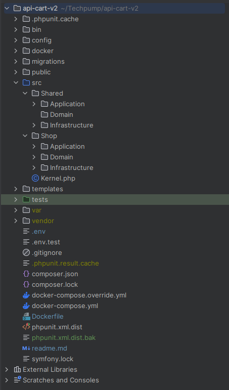

# Siroko Api Carrito

<!-- TOC -->

* [Siroko Api Carrito](#siroko-api-carrito)
    * [1. Instalación de Symfony desde cero](#1-instalación-de-symfony-desde-cero)
    * [2. Dependencias utilizadas](#2-dependencias-utilizadas)
    * [3. Configuracion framework](#3-configuracion-framework)
    * [4. Como hemos modelado la estructura (bounded context, domain, application, infrastrucure)](#4-como-hemos-modelado-la-estructura-bounded-context-domain-application-infrastrucure)
    * [5. Test Unitarios](#5-test-unitarios)

<!-- TOC -->

## 1. Instalación de Symfony desde cero

### Install php 8.1 via :

`sudo apt update` <br>
`sudo apt install php`

### Install Docker Engine

#### For ubuntu :

https://docs.docker.com/engine/install/ubuntu/

#### For Windows :

https://docs.docker.com/desktop/install/windows-install/

#### For MacOS :

https://docs.docker.com/desktop/install/mac-install/

### Create symfony proyect via :

`composer create-project symfony/skeleton:"6.2.*" my_project_directory`

`cd my_project_directory`

`composer require webapp`

`composer create-project symfony/skeleton:"6.2.*" my_project_directory`

#### **Si estas utilizando un proyecto ajeno, utiliza**

`composer install` Para instalar las dependencias del proyecto desde el composer.json file.

## 2. Dependencias utilizadas

### Doctrine :

###### Doctrine es una biblioteca de mapeo objeto-relacional (ORM) para PHP que proporciona una forma fácil de interactuar con bases de datos relacionales utilizando objetos. Doctrine es un proyecto de código abierto y es ampliamente utilizado en el desarrollo de aplicaciones PHP modernas.

### Symfony Apache Pack :

###### Symfony Apache Pack es un conjunto de archivos de configuración y scripts que facilitan la ejecución de aplicaciones Symfony en servidores web Apache. Incluye un archivo de configuración de host virtual Apache, un archivo .htaccess y un archivo de configuración PHP FPM.

### Doctrine Messenger :

###### Doctrine Messenger es un componente del framework Symfony que proporciona una implementación del patrón de cola de mensajes utilizando Doctrine, un popular mapeador objeto-relacional para PHP.

###### El objetivo principal de Doctrine Messenger es permitir el procesamiento asíncrono de mensajes en las aplicaciones Symfony. Permite definir manejadores de mensajes que reciben mensajes de una cola, los procesan y envían los resultados al remitente. Esto puede ser útil para tareas de larga duración o que consumen muchos recursos y que se pueden realizar en segundo plano, sin bloquear la aplicación principal.

### SQL :

## 3. Configuracion framework

### 3.1 Configuracion docker

##### Crea un dockerfile con el siguiente contenido :

```dockerfile
FROM php:8.1-apache
RUN docker-php-ext-install pdo_mysql
RUN a2enmod rewrite
RUN php -r "copy('https://getcomposer.org/installer', 'composer-setup.php');"
RUN php composer-setup.php --install-dir=/usr/local/bin --filename=composer
RUN php -r "unlink('composer-setup.php');"
RUN apt-get update && apt-get install -y unzip
RUN docker-php-ext-install pdo_mysql
RUN composer require symfony/apache-pack
RUN composer require --dev symfony/phpunit-bridge
RUN composer require --dev phpunit/phpunit
COPY ./docker/000-default.conf /etc/apache2/sites-available/000-default.conf
WORKDIR /var/www/html
```

#### Esto instalara algunas de las dependencias mencionadas anteriormente, aunque no todas, tambien copia el archivo 000-default.conf al contenedor docker cuyo contenido es :

```apacheconf
<VirtualHost *:80>
ServerAdmin webmaster@localhost
DocumentRoot /var/www/html/public
# ServerName siroko.local
ErrorLog ${APACHE_LOG_DIR}/error.log
CustomLog ${APACHE_LOG_DIR}/access.log combined

<Directory /app/public>
# DirectoryIndex index.php
Options All
AllowOverride All
Require all granted
</Directory>
</VirtualHost>
```

#### Tambien deberemos definir un docker.compose.yaml :

```dockerfile
version: '3'
services:
  php:
  build: ./
  ports:
  - "80:80"
  volumes:
    - ./:/var/www/html/
    - ./docker/:/etc/apache2/sites-available/
  working_dir: /var/www/html/

database:
image: 'mysql:latest'
environment:
MYSQL_USER: siro
MYSQL_PASSWORD: pass
MYSQL_ROOT_USER: root
MYSQL_ROOT_PASSWORD: root
MYSQL_DATABASE: cart-api-db
ports:
  # To allow the host machine to access the ports below, modify the lines below.
  # For example, to allow the host to connect to port 3306 on the container, you would change
  # "3306" to "3306:3306". Where the first port is exposed to the host and the second is the container port.
  # See https://docs.docker.com/compose/compose-file/compose-file-v3/#ports for more information.
  - '3306:3306'
```

### Tras haber definido los archivos mencionados y cambiado los credenciales del docker-compose.yaml :

`docker-compose up -d --build`

### Correr el siguiente comando en la terminal del contenedor docker :

`composer install`

## 4. Estructura de proyecto



La estructura de una aplicación Symfony es flexible, pero se recomienda la siguiente:

* app/ La configuración de la aplicación, plantillas y traducciones
* bin/ Archivos ejecutables (por ejemplo: bin/console)
* src/ El código PHP del proyecto
* tests/ Tests automáticos (por ejemplo: Unit tests)
* var/ Archivos generados (cache, logs, etc)
* _vendor/ _Dependencias de terceros
* web/ El directorio web raíz

## En el caso de este proyecto hemos utilizado arquitectura hexagonal y DDD lo que quiere decir que esta dividido en capas:

* ##### Capa de infraestructura: esta capa es responsable de la implementación de las diferentes tecnologías y herramientas que se utilizan en el proyecto, como la base de datos, la conexión de red, los servidores, etc. En este caso, como se trata de una API, la capa de infraestructura estará compuesta por la implementación de los servidores web, las bibliotecas y herramientas necesarias para comunicarse con otros sistemas y servicios, y cualquier otra herramienta necesaria para que la API funcione correctamente. Además, esta capa se encarga de proporcionar la configuración necesaria para que la aplicación se ejecute de manera eficiente en un entorno de producción.
* ##### Capa de aplicación: esta capa es la que contiene toda la lógica de negocio del proyecto. En el contexto de una API, esta capa se encargará de recibir las peticiones de los clientes, procesarlas y enviar la respuesta adecuada. Además, aquí se definirán las diferentes entidades del dominio, los casos de uso y las interfaces de los repositorios necesarios para acceder a los datos de la aplicación. En esta capa también se implementará el patrón de diseño Command, que es utilizado para separar la lógica de negocio de la lógica de transporte.
* ##### Capa de dominio: esta capa es la que contiene las entidades y la lógica de negocio que se utiliza en la aplicación. Esta capa es independiente de cualquier tecnología o herramienta específica y está diseñada para ser lo más reutilizable posible. Aquí se definen las reglas de negocio y se implementan los algoritmos necesarios para el correcto funcionamiento de la aplicación. Además, en el contexto de DDD, esta capa se encargará de la definición de los agregados y las raíces de agregados, que son los elementos clave del dominio.

###### En el contexto de Domain-Driven Design (DDD), un Bounded Context se refiere a una parte del modelo de dominio que tiene una semántica bien definida y limitada dentro del límite de un subdominio. Cada Bounded Context tiene su propio lenguaje y modelo que se utiliza para describir los conceptos y las reglas de negocio específicas de ese contexto.

###### Un Bounded Context se utiliza para definir los límites entre los diferentes subdominios y para ayudar a mantener una separación clara entre las diferentes áreas del modelo de dominio. Esto permite que el modelo de dominio se mantenga modular y fácil de entender, y ayuda a evitar conflictos y confusiones entre las diferentes partes del modelo.

###### Aplicaremos estas divison en capas a nuestros dos Bounded Context, Shop Y Cart .

## 5. Clases y Doctrine.

#### El ORM de Doctrine permite a los desarrolladores trabajar con objetos en lugar de con consultas SQL directamente, lo que simplifica el proceso de interacción con la base de datos y reduce la cantidad de código necesario para realizar operaciones CRUD.

#### Para que Doctrine pueda mapear correctamente los objetos de la aplicación a las tablas de la base de datos, se utiliza la técnica de Doctrine Mapping. Esta técnica permite definir una correspondencia entre los campos de una entidad (clase de objeto) y los campos de una tabla en la base de datos.

##### Hay diferentes maneras de mapear entidades en doctrine, como por ejemplo anotaciones y XML, en este caso utilizaremos XML ya que deja el codigo de la clase mas limpio aunque ambas son totalmente validas

## 5. Test Unitarios